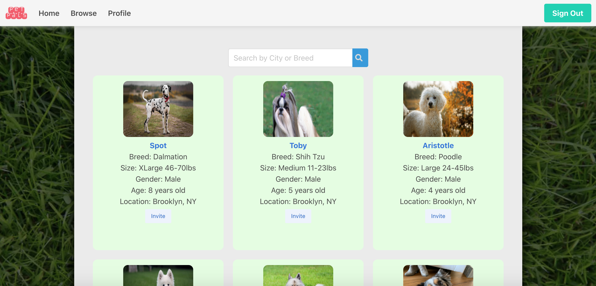

# Pet Pals - Rails App

## Project Demo

[petpals-finder.herokuapp](https://petpals-finder.herokuapp.com/) | [Summary Video](https://www.youtube.com/watch?v=deORxiINv8I)

## Description

A rails application designed for users to find and arrange play dates for their dogs.
* Users sign up to create an account.
* Once logged in to the app, users can create their pets, search for dogs, and schedule play dates.
* Users can edit and delete their account and pet data.

## Installation & Setup

* Clone the Pet Pals repository onto your computer.
  * Navigate to 'https://github.com/ellenupark/petpals'.
  * Click on the green **Clone** button.
  * Click on **HTTPS** if not already selected.
  * Click the **clipboard icon** to copy the URL.
  * In your terminal, type `git clone` then paste the copied URL.
* Type `cd petpals` to change the current working directory.
* Run `bundle install` to load the Ruby gems and dependencies.

## Usage

* Type `rails s` in your terminal to launch the server and run the Pet Pals application on your local machine
* Open your browser and navigate to http://localhost:3000/
* Once the home page loads, click **Sign Up** to create a new user account and login
  * Or click **Log In** to log in as an existing user from one of the users in 'db/seeds.rb'
> _To stop the server and exit, type `CTRL + C` in your terminal_

## Contributing

Bug reports and pull requests are welcome on GitHub at https://github.com/ellenupark/petpals.

## License
The app is available as open source under the terms of the [MIT License](https://opensource.org/licenses/MIT).

## Further Information
[Personal Website](https://ellenupark.github.io) | [LinkedIn](http://www.linkedin.com/in/ellenupark) | [Blog](https://ellen-park.medium.com/)